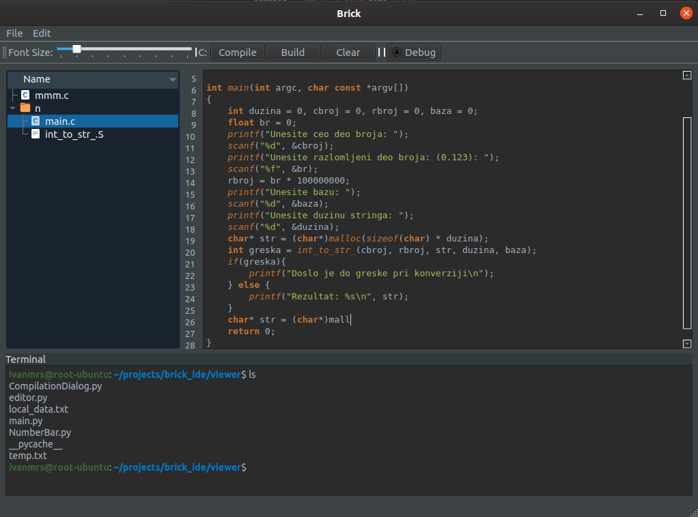

# BRICK IDE:
Simple, fast and lightweight IDE and text editor for C development made with python3 and PyQt5 graphic library.
It features basic IDE components such as creating projects, tree view, simple compiling and debugging, syntax highlighting and more...
It also has support for assembly files (.S).

# Preview:

